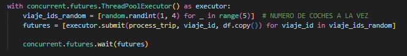
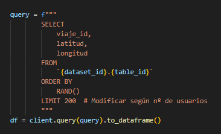
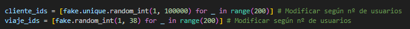

# EJECUTAR GENERADORES CON PYTHON

- generator.py

Para que funcione:

```powershell
python3 generator_vehicle.py `
    --project_id "dataproject-2-413010" `
    --topic_name "dp2_viajes"
```

```powershell
python3 generador_usuarios.py `
    --project_id "dataproject-2-413010" `
    --topic_name "dp2_clientes"
```

## INSTRUCCIONES

- Vehiculos:

Cambiar lo siguiente:



Donde el primer random es el número de viajes_id en lanzamiento.

Y donde el range es el número de vehículos en circulación.

- Clientes

El limit muestra el numero total de clientes, modificar en función de cuantos quieras:



También modificar estas dos variables:


